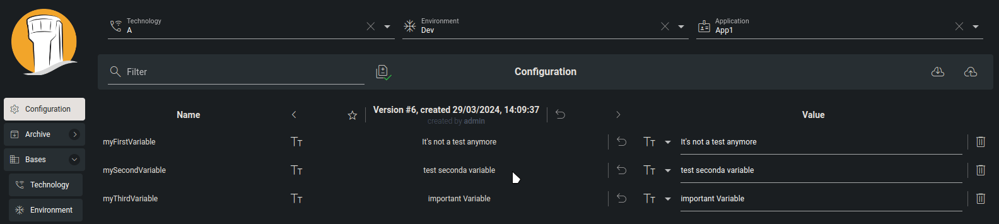
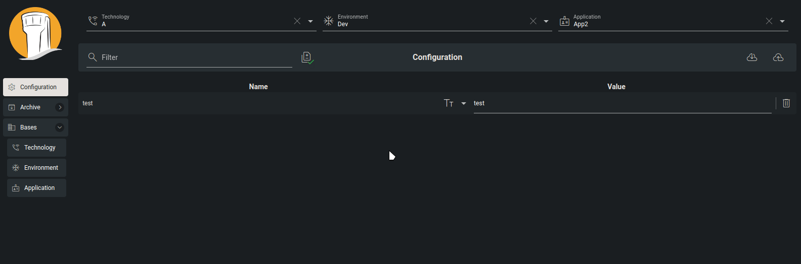

# Configuration

### Overview

In Tower, a configuration refers to a collection of key/value variables organized within a defined hierarchical structure. For instance, if we'd refer to our [example](../how-to-start/example.md), you can craft a configuration for the "App1" application within the "Development" environment and under the "A" technology, constituting one configuration instance. Similarly, creating a comparable configuration for "App2" application within the same technology and environment would represent another configuration instance.

At the same time, every configuration instance retains a record of all modifications applied to it. This allows users to review or revert to any previous configuration instance whenever necessary.

Another advantage of employing a hierarchical structure is the ability to store configuration components across different tree levels. This facilitates the sharing of configuration variables among various applications.

### How to create your first configuration?

<figure><figcaption>
How to create configuration using Tower
</figcaption></figure>

Creating a configuration instance in Tower is straightforward. Simply navigate to your desired configuration path (as demonstrated in the video above) and add the necessary configuration variables. Then, click the "Save configuration" button, and your configuration is securely stored.

### Configuration versioning

Configurations for your application may evolve over time due to various factors such as new releases, feature enhancements, or changes in API URLs. Tracking and recalling these modifications can be challenging. Fortunately, Tower offers a solution. On the configuration page, you can easily compare your current configuration instance with previous iterations. If issues arise with your current configuration—whether due to mistakes, testing, or incorrect values—you have the option to revert to a previous configuration instance or selectively restore specific variables.

#### History reviewing and reverting variables

To navigate through all the configuration versions, access your configuration instance on the configuration page. Click the left arrow button to move to the previous configuration or the right arrow button to proceed to the next one. If you need to revert to any variable from a specific version, simply click on the "undo" button next to the corresponding configuration variable (as demonstrated in the video below).

<figure><figcaption>
History reviewing and reverting variables
</figcaption></figure>

You can also go back to one of the previous configuration instances just by clicking the "undo" button next to the configuration version.

<figure><figcaption>
Full configuration revert
</figcaption></figure>

### Variable types

Each configuration, just like each application is different. And at the same time, each application needs configuration data in different format. That's why Tower supports multiple variable types, from simple onse, like string complex lists or collecting data from AWS Secrets Manager.

| Type     | Description                                                                                                                                                                       |
| -------- | --------------------------------------------------------------------------------------------------------------------------------------------------------------------------------- |
| String   | Regular text variable                                                                                                                                                             |
| Password | Variable visibly hidden and encrypted on the database side                                                                                                                        |
| Text     | Similar to String type, the only difference is the way it's displayed on the user interface                                                                                       |
| Number   | Numeric value                                                                                                                                                                     |
| Boolean  | Variable can be assigned to true or false only                                                                                                                                    |
| List     | An array of text variables                                                                                                                                                        |
| Vault    | HashiCorp Vault Key. This variable will not be visible on the Tower user interface, it will only be collected when application requests for its configuration                     |
| AWS      | AWS Secrets Manager secret name and key. This variable will not be visible on the Tower user interface, it will only be collected when application requests for its configuration |

<figure><figcaption>
Variable types
</figcaption></figure>

### Constant variables

A constant variable in Tower is a variable that isn't directly associated with any single configuration; rather, it can be inherited by multiple configuration instances. This means that instead of placing the variable directly within a configuration, it can be placed at any branch of the hierarchical tree. For example, placing a constant variable on the "A" technology level would result in all configurations under the "A" technology inheriting the variable. Similarly, placing a variable at the "Dev" environment level under the "A" technology would result in only configurations under both the "A" technology and "Dev" environment inheriting the variable.

#### How to create a constant variable?

Creating a constant variable is similar to creating the configuration, with one distinction: it's done at the branch level rather than the leaf level of our configuration hierarchical tree.

<figure><figcaption>
Creating new constant variable
</figcaption></figure>

#### Constant variable properties

Every constant variable in Tower comes with a set of properties that not only govern its behavior but also dictate how it impacts your configuration instances. Alongside the variable type, which behaves consistently across constant and configuration variables, there are two additional properties: "Editable" and "Add if not in configuration". These properties serve distinct purposes and have varying effects on configuration instances.

#### Editable

<figure><figcaption>
Editable variable
</figcaption></figure>

By default, constant variables are non-editable, meaning their values are enforced at the configuration instance level. However, this behavior can be modified using the editable toggle.

#### Add if not in configuration

<figure><figcaption>
Add if not editable
</figcaption></figure>

By default, configuration instances inherit all constant variables from higher levels within the hierarchy. However, this behavior can be adjusted by toggling the "Add if not in configuration" switch. When activated, this switch allows constant variables to be included in configuration instances only if they are explicitly defined within that specific instance.

#### Constant variables in configuration

<figure><figcaption>
Constant variable in configuration
</figcaption></figure>

In Tower, constant variables within configuration instances are easily recognizable by a distinct banner icon that precedes their names. These variables are either modifiable or not, depending solely on their individual configuration settings. Interestingly, should you introduce a new configuration variable with a name matching an existing constant variable, it could potentially supersede the value of the constant variable.
