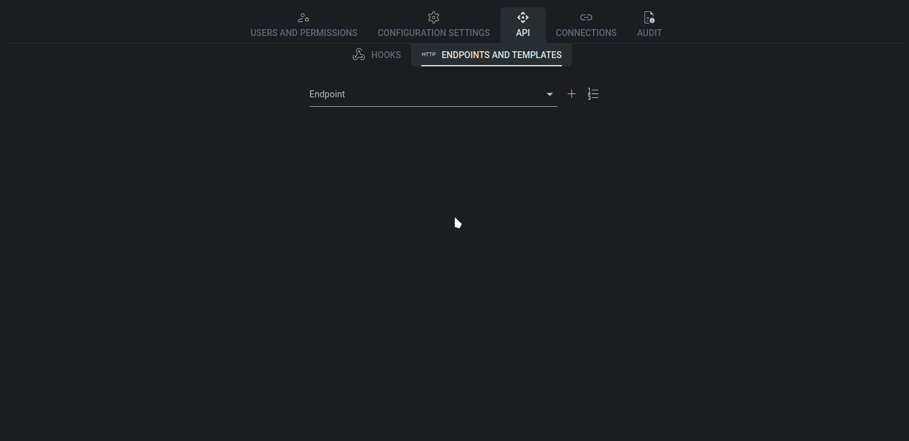

# Endpoints and templates

The endpoints and templates page in Tower represents a highly versatile and powerful functionality. This is where you can configure the specific endpoints that your Tower instance will use to serve configurations to your applications. In addition to setting up endpoints, you can define templates that dictate how configurations will be structured and provided.

Configuring endpoints allows you to tailor the delivery of configurations to suit the needs of different applications. Each configured endpoint can be customized with a specific template, ensuring that the served configuration is formatted in a way that the receiving application can understand and process effectively.

## How to configure a new endpoint

To create a new endpoint in Tower, click on the "+" button next to the "Endpoint" input. This action will display a new endpoint template with pre-filled "template" and "Return type" inputs using default values. The only input that requires your attention is the URL field. Enter the URL details, ensuring to use curly braces ({}) to specify Base names (e.g., {Environment}) for Tower to interpret correctly during endpoint execution.

In the URL input, specify the Base Configurations you're utilizing by using single curly braces ({}) around Base names, such as {Environment}. It's essential to incorporate as many Base names as possible (ideally all of them) in the URL to enable Tower to locate the correct configuration instance when executing the endpoint, e.g. {Technology}/{Environment}/{Application}.

After entering the URL and filling out any other required inputs on the endpoint template, click the "Save changes" button to save your configuration. This process ensures that the new endpoint is properly configured and ready to serve configurations tailored to your specified Base Configurations within Tower.

<figure><figcaption>
Configure new endpoint
</figcaption></figure>

### Templates

Templates in Tower are essential for customizing how configurations are served to applications via endpoints. Each endpoint in Tower is associated with a template that defines the structure and content of the served configuration.

Tower employs the [liquid template](https://shopify.github.io/liquid/) engine to generate the output based on the configured template. By default, Tower includes several variables that can be utilized within templates:

* **variables:** Represents all the configuration variables as a list. Each object within this list contains three key attributes:
  * **name:** The name of the variable.
  * **type:** The type of the variable.
  * **value:** The current value of the variable.
* **version**: Represents the configuration instance version

Additionally, templates within Tower automatically include all the Base names provided in the associated endpoint.

