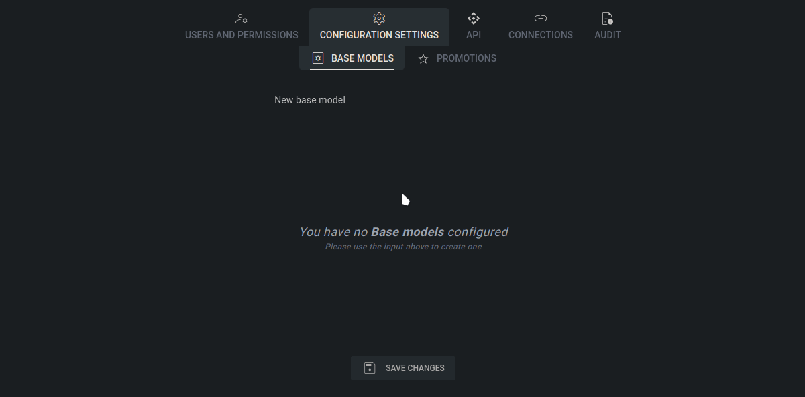
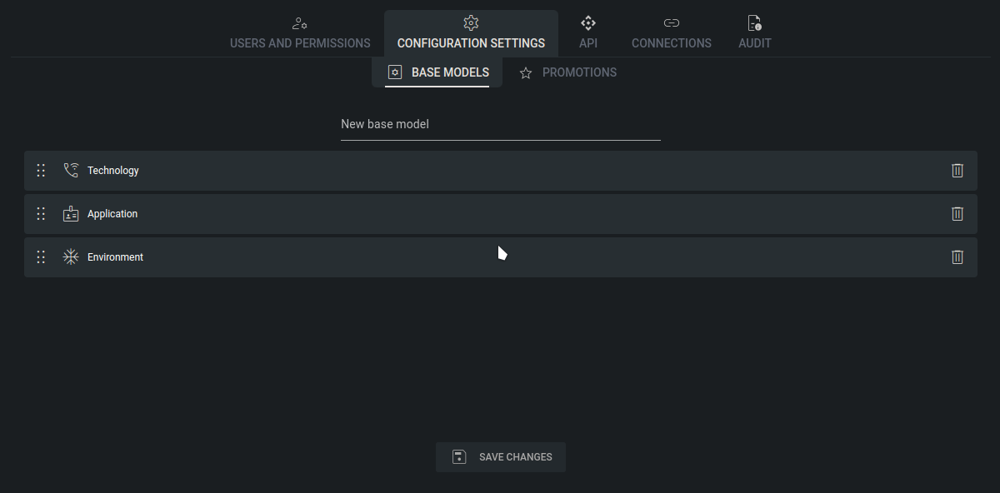

# Base Models

Base Models in Tower are the foundational framework that organizes configuration data within the system. They provide a hierarchical structure that mirrors the organization's needs, like technology stack, environments, applications, and more. This hierarchical organization allows administrators to manage configurations at different levels of granularity, aligning with the organization's IT architecture.

At each level of the Base Model hierarchy, such as "technology," "environment," and "application," administrators can define specific categories that reflect different aspects of the organization's IT landscape. For example, the "technology" level might encompass various technologies or systems used within the organization (e.g., A, B, C), while the "environment" level could represent different deployment environments (e.g., Development, Test, Production).

One of the key advantages of Base Models is their flexibility. Administrators can customize and tailor the Base Model hierarchy to suit the organization's specific needs and technology stack. This customization enables the creation of custom configurations that accurately reflect the complexities of the organization's IT infrastructure.

## How to create a new Base Model

Creating a new Base Model in Tower is a straightforward process designed to simplify configuration management. To initiate the creation of a Base Model find an input field labeled "New base model" where you can enter the desired name for the new Base Model. Once you've entered the name for the new Base Model, proceed to click on the plus (+) sign icon located next to the input field. This action adds the specified name to the list of Base Models you wish to create within Tower's configuration hierarchy.

To finalize the creation of the new Base Model, simply click the "Save Changes" button. This action confirms the addition of the Base Model and integrates it into Tower's configuration framework.

<figure><figcaption>
Base model creation
</figcaption></figure>

## Changing hierarchy order

Once you've created a Base Model in Tower, you might realize that its position in the hierarchy needs adjustment. Tower provides a convenient way to reorder Base Models within the hierarchy tree. Simply use the drag-and-drop functionality to move a Base Model to its desired location.

To rearrange a Base Model, locate it within the hierarchy view and drag it to the preferred position. You can move the Base Model up or down within the tree structure until it's positioned correctly relative to other models.

After arranging the Base Models according to your preference, click the "Save changes" button to finalize the hierarchy adjustments. Tower will update the configuration framework accordingly, reflecting the new order of Base Models within the hierarchy.

<figure><figcaption></figcaption></figure>
