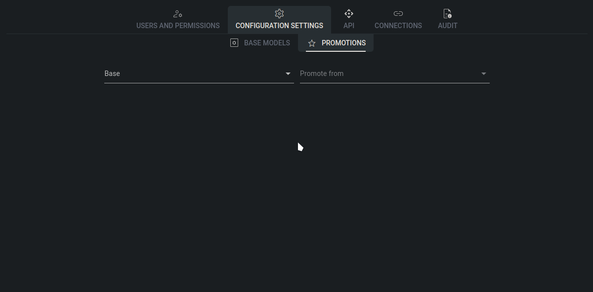

# Promotions

The promotions page in Tower facilitates the management of configuration promotions, enabling you to specify from which Base a configuration instance can be moved and to which destination. This feature allows you to mark specific configuration instances with a promotion tag, enabling the copying of these instances from one hierarchy tree to another within Tower.\
For example, suppose you want to promote a configuration instance originally located in the development (DEV) environment to the test (TEST) environment. By specifying the source environment (DEV) and defining the target environment (TEST), you can seamlessly copy the configuration settings and variables from DEV to TEST.

## How to configure promotions

To configure a promotion in Tower, start by selecting the source Base Configuration from which the promotion originates. Use the "Base" dropdown menu to choose the relevant Base, and then select the specific Base Configuration from the "Promote from" dropdown. Next, identify the target Base Configuration to which the promotion will apply.

<figure><figcaption>
Promotion configuration
</figcaption></figure>
