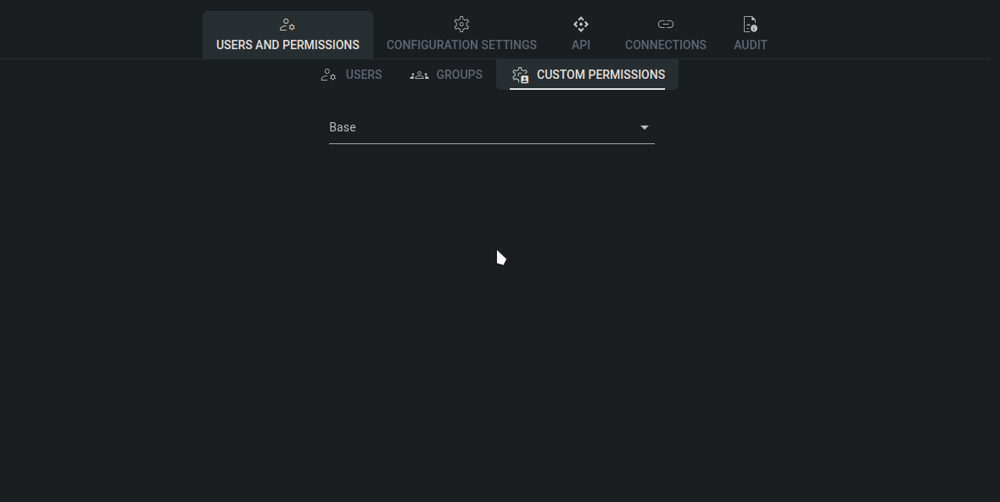

# Custom permissions

In Tower, "custom permissions" refer to user-defined access controls that extend the default set of permissions available in the system. These custom permissions allow administrators to finely tune access rights based on specific needs and organizational requirements.

Custom permissions are associated with configuration models (also known as [Bases](../../model.md)) and govern the actions users can perform on these models. For example, administrators can create custom permissions to control whether a user can modify or view a particular configuration base.

## How to create a custom permission

To create custom permissions in Tower, follow these steps:

1. **Select Base Model**: Choose the specific Base Model (configuration model) to which you want to add the custom permission.
2. **Configure Custom Permission**: Next to the Base Model name, click the checkbox. This action creates both "modify" (edit) and "view" (read-only) permissions for the selected model.
3. **Save Changes**: After configuring the custom permission settings, click the "Save changes" button to apply the changes and create the custom permission.

<figure><figcaption>
Creating custom permission
</figcaption></figure>
