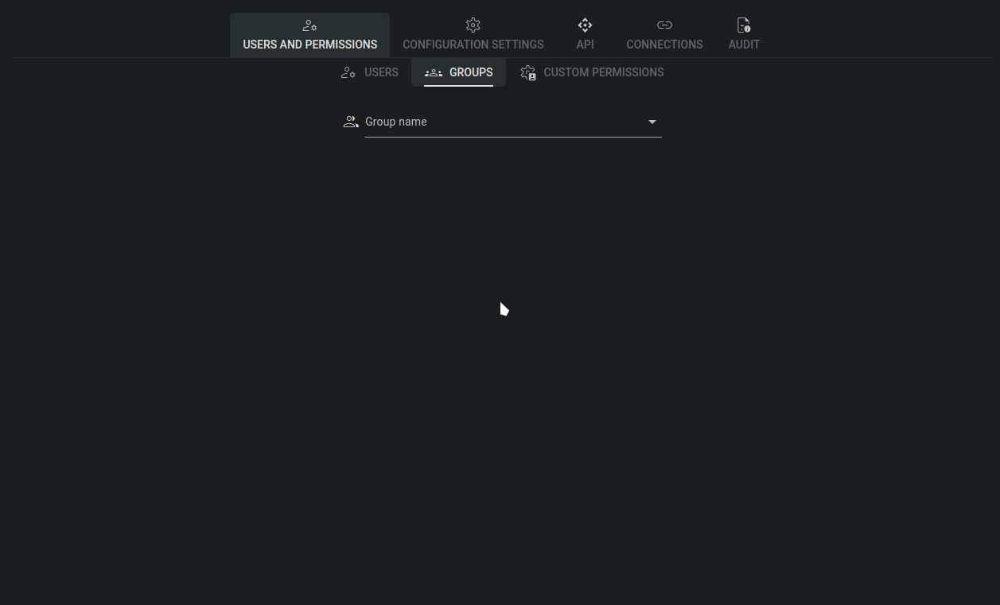

# Groups

## Overview

In Tower, groups are organizational units used to manage and assign permissions to users. By grouping users with similar access needs together, administrators can efficiently control permissions across the organization. Groups streamline permission management by allowing administrators to assign permissions to a group rather than to individual users, simplifying the process and ensuring consistency. Additionally, groups facilitate scalability and flexibility, as permissions can be easily adjusted by modifying group settings rather than individual user accounts.

## How to create a new group

Creating a new group in Tower is a straightforward process. Begin by entering the group name into the designated text input field and click the "plus" button to create the group. Once the group is created, you can specify the permissions you wish to assign to the group members by selecting from the available options. After configuring the permissions, simply click the "Save changes" button to finalize the group settings.

<figure><figcaption>
group creation
</figcaption></figure>

## Default group permissions

Out of the box, Tower offers a variety of permissions to cater to different user roles and responsibilities:

1. **admin**: Grants full permissions to the user, allowing unrestricted access to all features and functionalities within Tower.
2. **configuration.modify**: Enables users to create new configuration instances.
3. **configuration.view**: Allows users to view existing configuration instances.
4. **configurationModel.modify**: Empowers users to create and modify configuration models, commonly known as [Bases](../../model.md).
5. **configurationModel.view**: Grants users the ability to view existing configuration models ([Bases](../../model.md)).
6. **constantVariable.modify**: Enables users to create and modify [constant variables](../../../models/constant-variable.md).

## Custom group permissions

Custom group permissions are user-defined permissions that extend the default set of permissions available in Tower. These custom permissions can be tailored to specific needs and use cases, providing granular control over access and capabilities within the system.

Custom permissions are closely tied to a configuration model ([Base](../../model.md)) and govern the user's ability to edit or view the specified model. By defining custom permissions, administrators can precisely control access to configuration models based on individual requirements and organizational policies.

For more detailed information on creating and managing custom permissions, refer to the [Custom permissions](custom-permissions.md) section, where you can explore advanced configurations and fine-tune access control to align with your organization's needs.

Each custom permission is displayed within the group permission view as a descriptive text composed of specific elements:

* **configurationModel**: This indicates the type of permission related to a configuration model (Base).
* **Base model name**: The name of the [base model](../configuration-settings/base-models.md) used to create the permission, providing context for the associated configuration structure.
* **Base name (Base)**: Specifies the [configuration base](../../model.md) name associated with the permission, identifying the location or scope of the permission.
* **Permission modifier**: This modifier specifies the type of permission granted, either "modify" (allowing modifications) or "view" (enabling viewing access).
