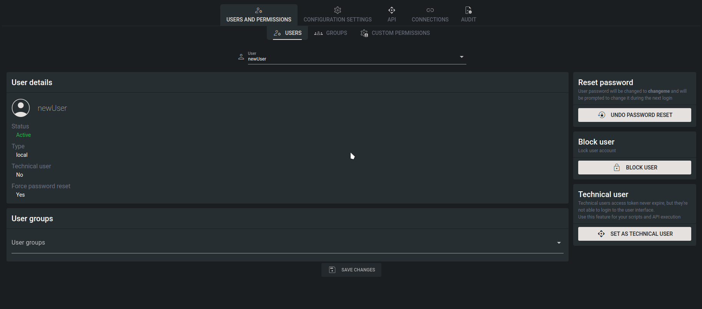
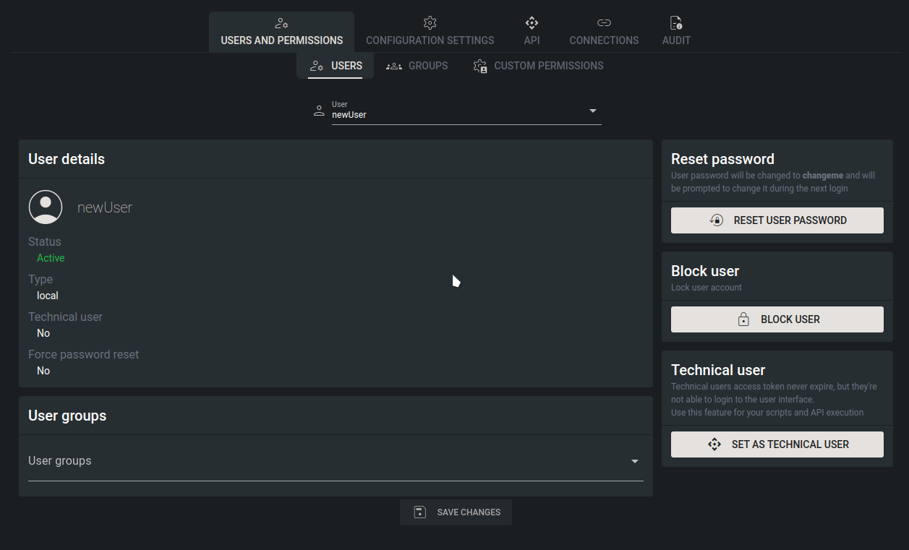

# Users

## Overview

The Users page serves as the central hub for managing user accounts within Tower. From here, you can perform various actions such as creating new accounts, blocking existing ones, resetting passwords, adjusting group memberships, and setting users as technical users.

## How to create a new user account

Creating a new user account is as simple as entering the account name and clicking on the "+" button. This action generates a user from a template, which can then be saved to the database using the "Save changes" button at the bottom of the screen.\
Upon creation, a new user is established with no permissions and an initial password set to "_changeme_." This default password prompts users to update their password upon their first login.

<figure><figcaption>
User creation
</figcaption></figure>

## User properties

\
Each user account is characterized by five distinct properties, each serving a unique purpose:

1. **Status**: Indicates whether the account is active or blocked, controlling the user's access to the system.
2. **Type**: This system property indicates whether the account is a local account, created within Tower, or an LDAP account sourced from an external directory service.
3. **Technical User**: Designates whether the user account is intended for technical purposes, such as automated processes or integrations.
4. **Force Password Reset**: Determines whether the user is required to reset their password upon the next login.
5. **User Groups**: Assigns the user to one or more groups, facilitating efficient management of access permissions and organizational structure.

### User status

Currently, there is no option to completely remove a user account from Tower. However, you can effectively disable user access by blocking them, thereby preventing them from performing any actions within the system.

To change the user status, simply click on the "Block user/unblock user" button, then confirm the action by clicking the "Save Changes" button.

<figure><figcaption>
Blocking user account
</figcaption></figure>

### Technical user property

The Technical user property serves dual functionality within Tower. Firstly, it signifies that the user account is designated for technical purposes, implying that direct login to Tower's interface is not intended. Instead, technical users are typically associated with automated processes or system integrations.

Additionally, enabling the Technical user property introduces two significant changes to the account behavior. Technical users are equipped with their own API token, ensuring seamless integration with external systems or automated workflows. This API token remains valid indefinitely, eliminating the need for regular token renewal and facilitating uninterrupted system interactions.

<figure><figcaption>
Switching account to technical
</figcaption></figure>

### Force password reset

If the user account is managed by Tower, you have the option to reset the user's password, prompting them to change it during their next login. This functionality simply sets the user password to "_changeme_," ensuring a temporary placeholder until the user updates it to a more secure password of their choice.

<figure><figcaption>
Reset password
</figcaption></figure>

### User groups

Permissions in Tower are managed through the assignment of user groups to user accounts. Each user account can be assigned to multiple [groups](groups.md), each with its own set of permissions. As a result, the user's overall permissions are determined by a combination of the permissions granted across all assigned groups. This flexible approach allows administrators to tailor access levels precisely to each user's role and responsibilities within the organization. Additionally, it enables efficient management of permissions by grouping users with similar access needs together and applying permissions uniformly across those groups.

<figure><figcaption>
User groups
</figcaption></figure>
