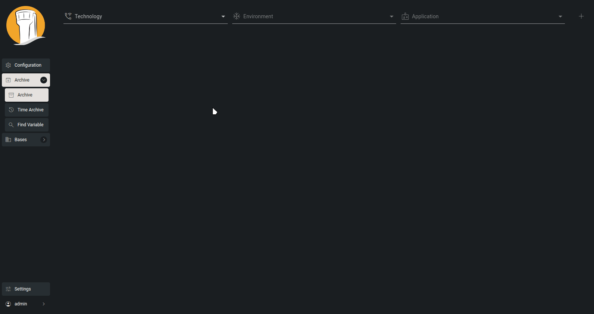
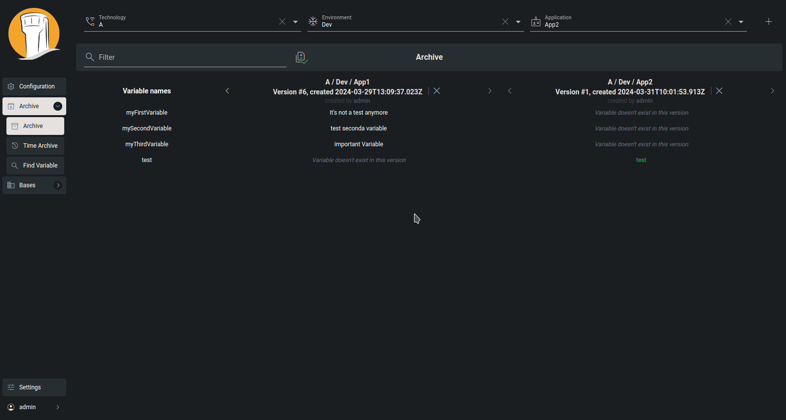

# Archive

The Archive page serves as a central hub where users can inspect and contrast configuration instances from various branches within the hierarchical tree. It provides access to both current and past versions of configuration instances, enabling users to compare up to four instances simultaneously.

To display the archived version for the selected configuration instance, simply navigate to the desired path using the browser located at the top of the screen, then click on the plus button. You can add up to four different configuration instances and compare them with each other.

<figure><figcaption>
Archive
</figcaption></figure>

However, it's important to note that all configuration instances are compared to the first one on the left. The good news is that you can rearrange them using drag-and-drop functionality.

<figure><figcaption></figcaption></figure>
