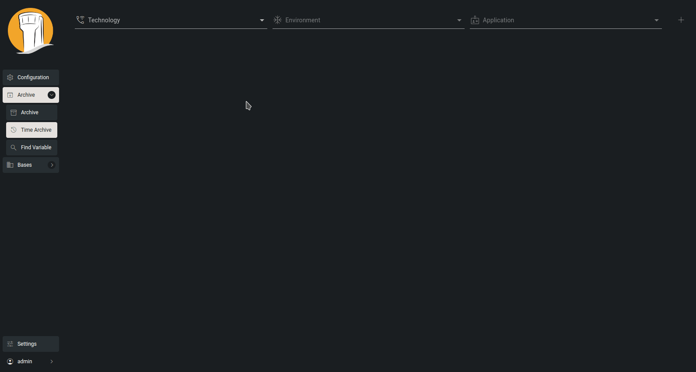

# Time Archive

The Time Archive page closely resembles the [Archive](archive.md) page, but with a crucial distinction: it doesn't just display configuration instance versions; rather, it showcases the configuration served to applications at specific points in time. This means that the configurations on the Time Archive page will include both configuration instances and any incorporated constant variables.

<figure><figcaption>
Time archive
</figcaption></figure>
